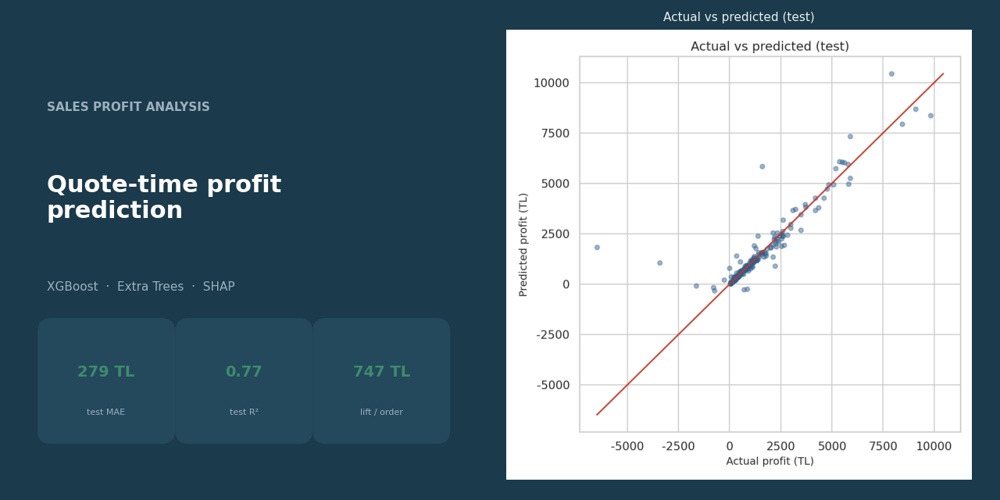
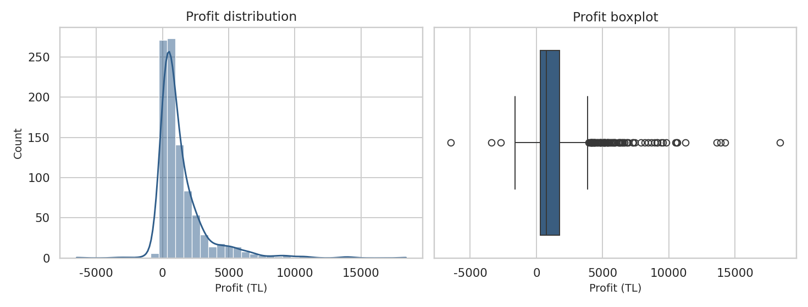
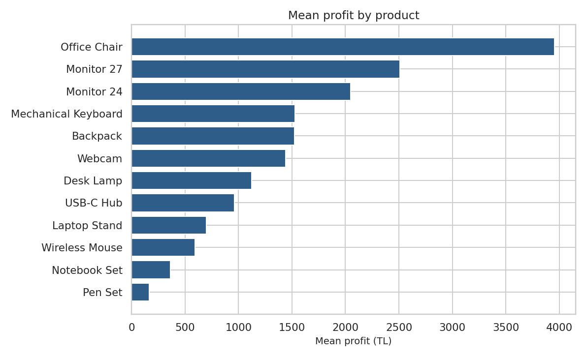
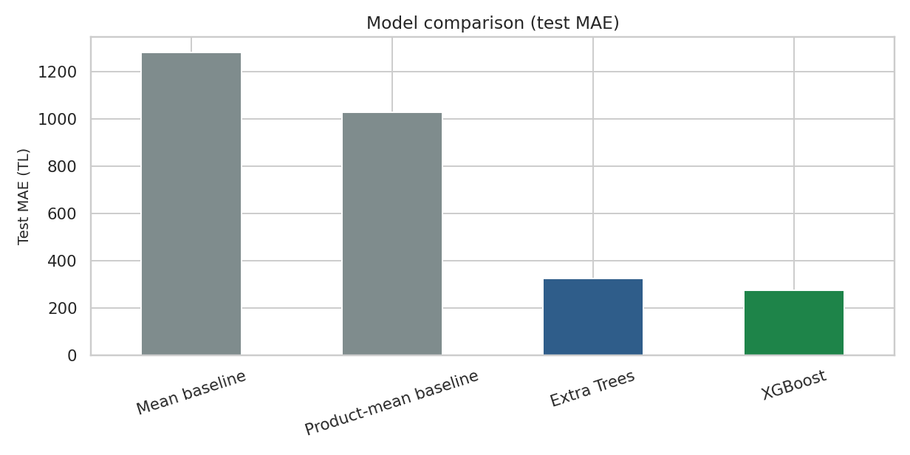
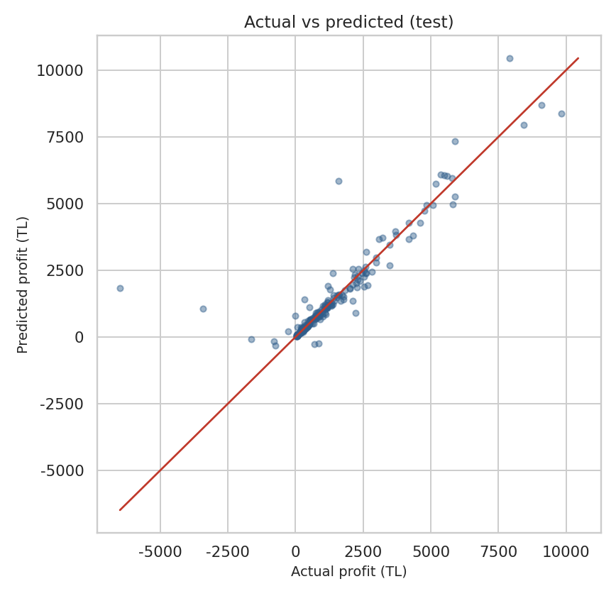
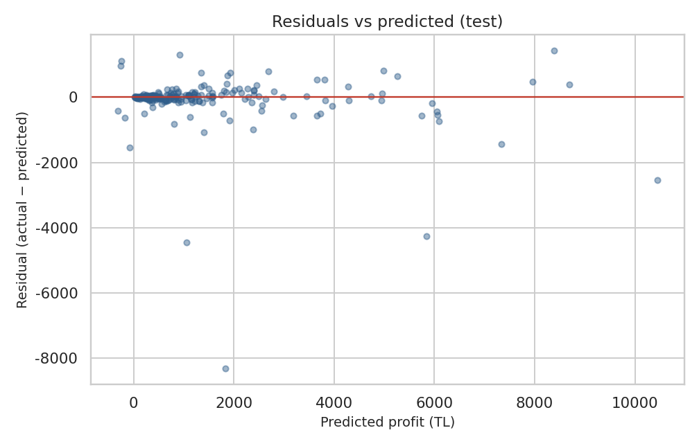
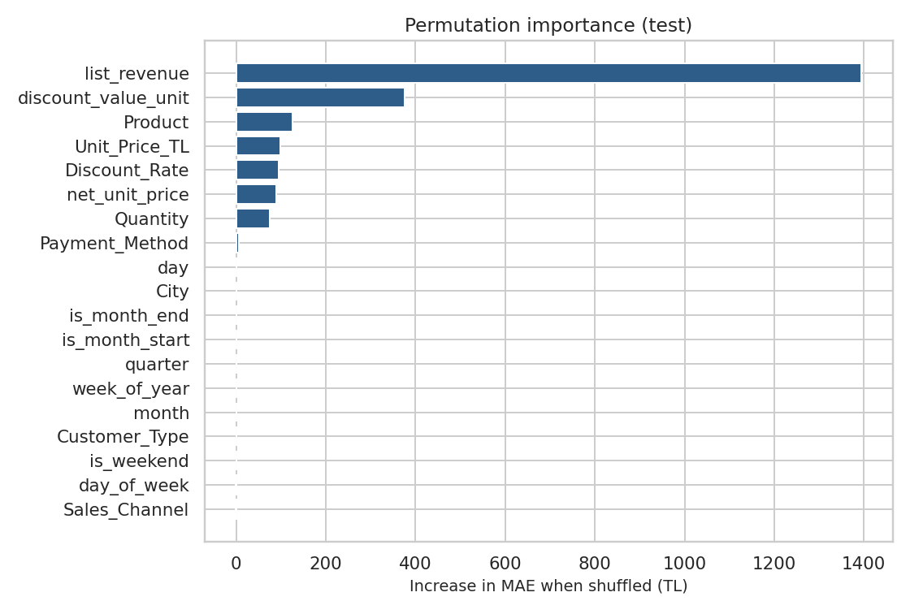
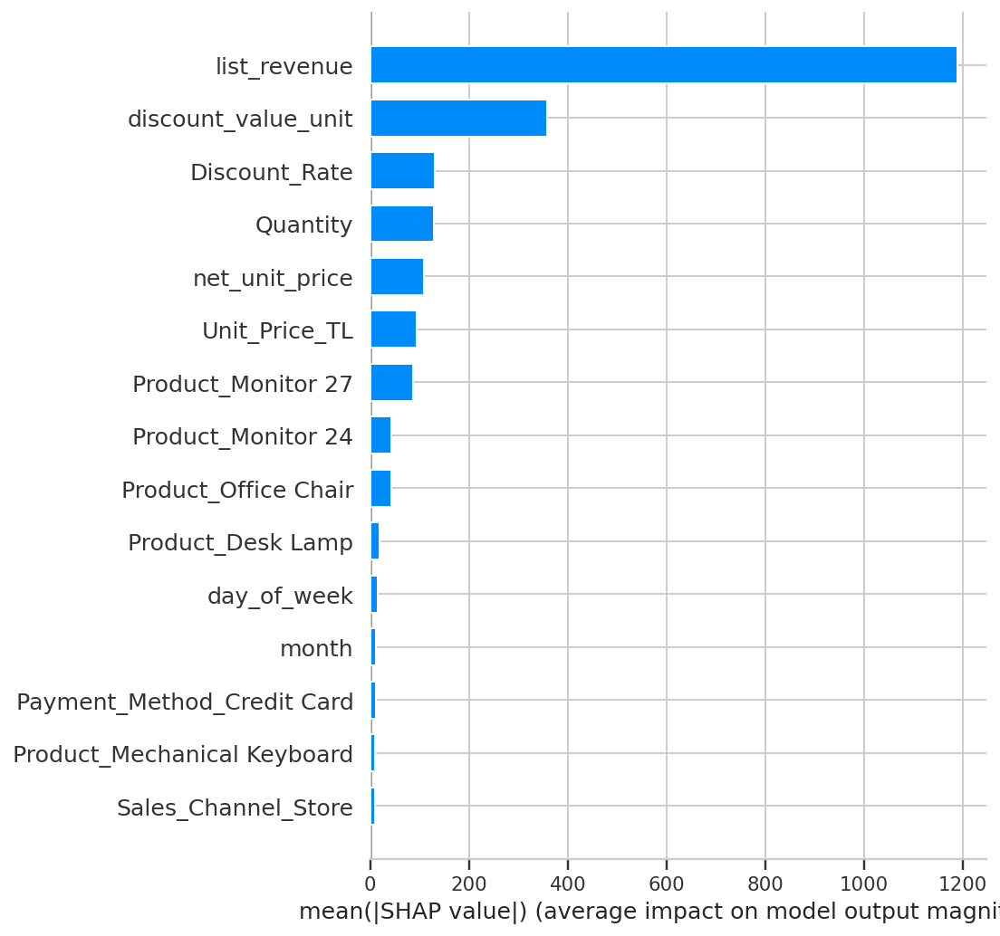
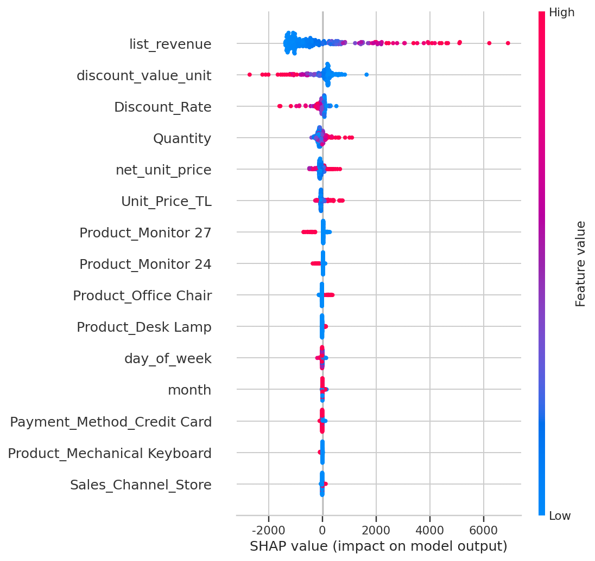

# Sales Profit Analysis



Quote-time profit prediction and categorical inference on **958 synthetic retail orders** (Jan–Jun 2026). The model estimates `Profit` from information known when the order is placed — product, city, channel, quantity, list price, discount — **without unit cost or post-sale accounting fields**.

Everything runs **offline**. No API keys, tokens, or cloud calls.

## Dataset

**This is a synthetic retail order dataset**, created for portfolio work and methodological demonstration (cleaning, leakage control, chronological validation, inference, and explainability). It is **not** production data from a live company, and it should not be read as a real P&L.

The public repo includes the **cleaned** tables only (`data/cleaned_sales_data*.xlsx`). A raw extract is not published.

| | |
|--|--|
| Rows | 958 orders |
| Window | 2026-01-01 to 2026-06-30 (synthetic calendar) |
| Grain | One row = one order |
| Target | `Profit` (TL) |

## What this project found

On a chronological hold-out (215 later orders, 26 May–30 Jun 2026), tuned **XGBoost** estimates order profit with **MAE 279 TL**. A product-average guess is off by **1,026 TL**. That is **747 TL closer per order**, or about **161,000 TL less total absolute error** on the test month.

Median error falls from **587 TL** (product average) to **69 TL**. Test R² is **0.77**. Extra Trees is worse (MAE 323 TL). Reconstructing profit from cost and revenue is not a model: that identity has MAE ≈ 0.002 TL and is excluded on purpose.

| Decision | Evidence |
|----------|----------|
| Put the model in front of delayed cost accounting | 747 TL / order better than the best naive baseline |
| Grow furniture / Office Chair, not stationery | Product explains **27%** of profit variance; Office Chair vs Pen Set ≈ **3,791 TL** mean gap; Furniture vs Stationery ≈ **3,708 TL** |
| Prioritise corporate accounts | Corporate mean profit is **761 TL** above Individual and **725 TL** above SME (FDR-significant) |
| Do **not** treat city or region as a profit lever | City and region are **not significant** after permutation ANOVA + BH-FDR (η² ≈ 1%) |
| Store vs online is a weak signal | Channel is significant unadjusted, **not** after FDR (η² = 0.6%; Store vs Dealer ≈ 336 TL) |

**How to read the money numbers.** The 161,000 TL figure is the sum of absolute prediction error avoided versus a product-mean rule on 215 unseen orders. It is the value of a better **quote-time expectation** on this synthetic table, not cash booked by a live system.

## Results (figures)

















## Pipeline

```
.
├── src/
│   ├── data_processing.py
│   ├── features.py
│   ├── train.py
│   ├── evaluate.py
│   └── explain.py
├── data/                            # cleaned synthetic tables
├── models/                          # fitted pipeline (joblib)
├── reports/figures/                 # README plots
├── notebooks/sales_ml_analysis.ipynb
├── tests/
└── matlab/                          # ANOVA / permutation analysis
```

From the repository root:

```bash
python -m pip install -r requirements.txt
python -m src.train
pytest
```

`python -m src.train` fits XGBoost and Extra Trees on a chronological split, writes `models/profit_model.joblib`, `reports/metrics.json`, and the figures above. Add `--tune --trials 20` to re-run Optuna on train `TimeSeriesSplit` MAE.

Full narrative (EDA, leakage identity, learning curves) is in `notebooks/sales_ml_analysis.ipynb`. Open it with the repo root (or `notebooks/`) as the working directory; it resolves `data/` automatically.

### Model comparison (test set)

| Model | CV MAE | Train MAE | Test MAE | Test RMSE | Test R² | Test Median AE | Test sMAPE |
|-------|-------:|----------:|---------:|----------:|--------:|---------------:|-----------:|
| Mean baseline | — | — | 1281.71 | 1837.78 | −0.004 | 1016.58 | 92.53 |
| Product-mean baseline | — | — | 1026.12 | 1620.73 | 0.219 | 587.41 | 74.15 |
| Extra Trees (tuned) | 396.74 | 101.33 | 322.78 | 913.11 | 0.752 | 83.35 | 22.58 |
| **XGBoost (tuned)** | **305.41** | 58.89 | **279.14** | 871.22 | 0.774 | 68.87 | 22.17 |

SHAP / permutation: commercial size (`list_revenue`, quantity, prices, discount) and product identity dominate.

## Statistical inference (`matlab/`)

Question: do `City`, `Region`, `Product`, `Category`, `Sales_Channel`, `Customer_Type` differ in `Profit`?

In MATLAB, set the current folder to `matlab/`, then run `categorical_profit_analysis.m`.

| Feature | Groups | FDR (BH) | η² | Decision |
|---------|-------:|---------:|---:|----------|
| `Product` | 12 | 0.0002 | 0.27 | significant |
| `Category` | 5 | 0.0002 | 0.22 | significant |
| `Customer_Type` | 3 | 0.0002 | 0.02 | significant |
| `Sales_Channel` | 3 | 0.073 | 0.006 | not after FDR |
| `Region` | 6 | 0.265 | 0.007 | not significant |
| `City` | 10 | 0.323 | 0.011 | not significant |

## Cleaning

Rebuild from a local raw file only if you have `raw_sales_data.xlsx` next to `clean_sales_data.py`:

```bash
python clean_sales_data.py
```

The cleaned English tables used by later stages are already in `data/`.

## Reproducibility

| Setting | Value |
|---------|--------|
| Python seed | 42 |
| MATLAB seed | `rng(42)` |
| Optuna | 20 trials (TPE), optional `--tune` |
| Permutations | 10,000 |
| α | 0.05 |

No secrets, no `.env`, no absolute paths in source or logs.
